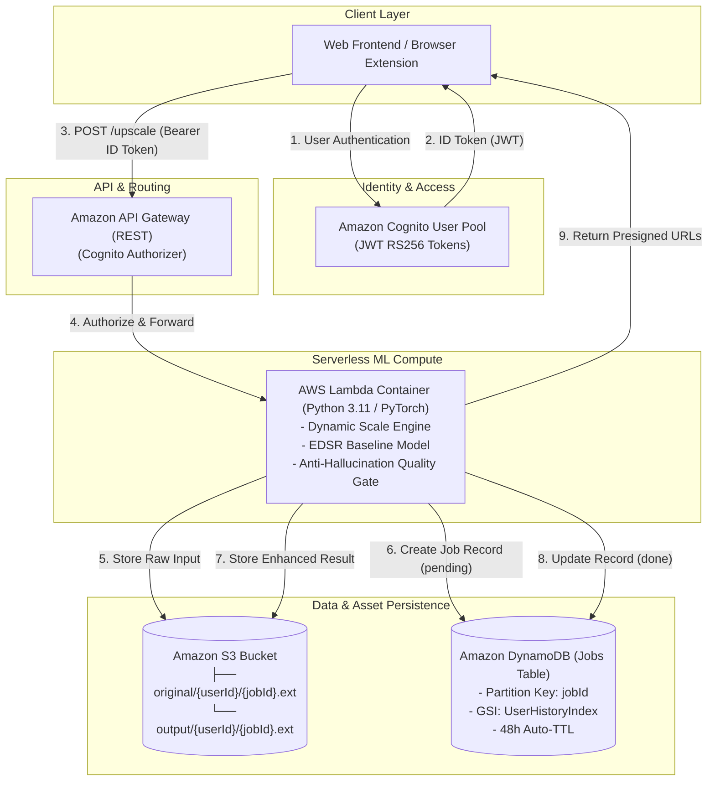
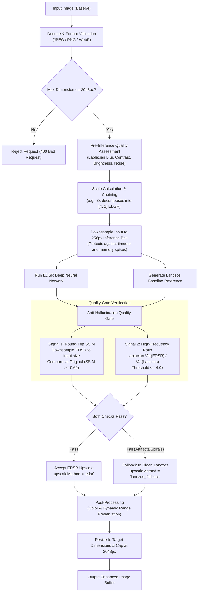
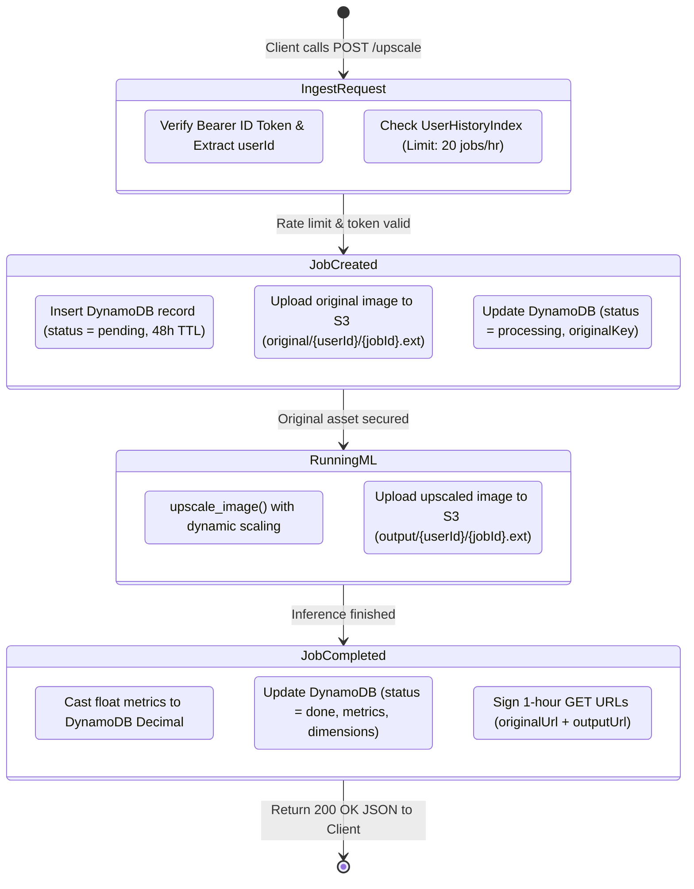
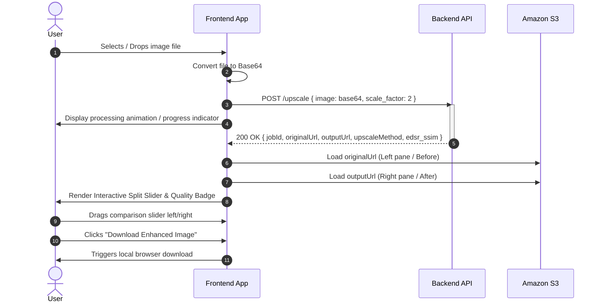
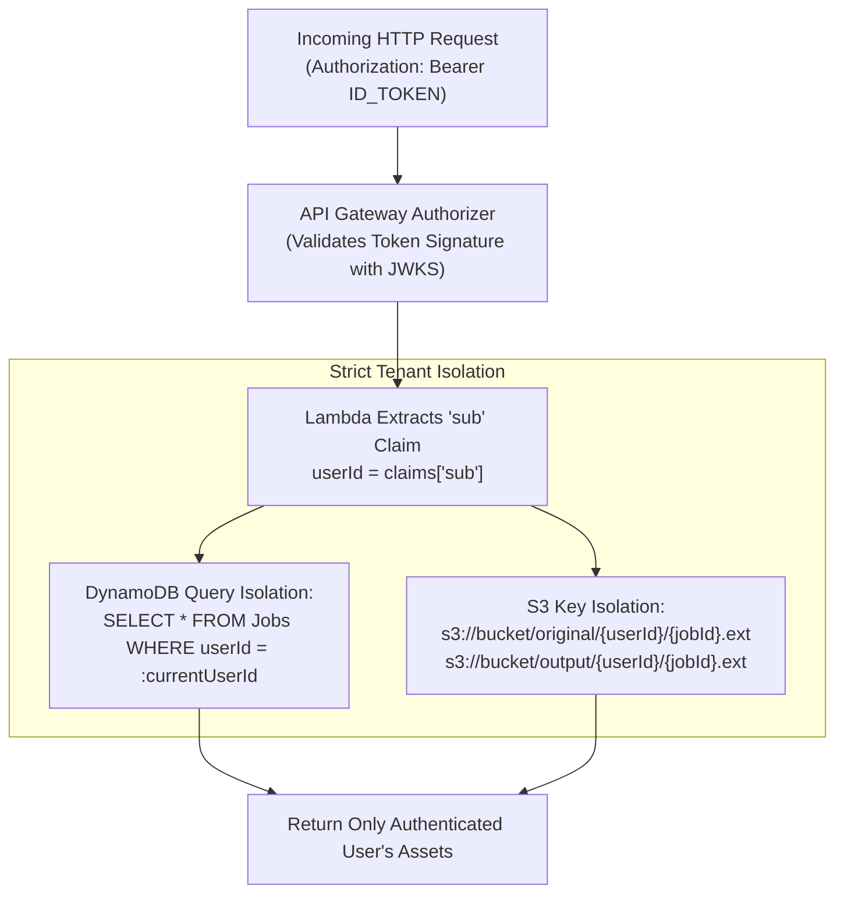

# SATUpscale — System Architecture & Workflow Flowcharts

> **Note:** All diagrams in this document use standard **GitHub Flavored Mermaid syntax**. They render interactively on GitHub, in VS Code / IDE markdown previews, and in documentation sites.  
> **Privacy Notice:** All proprietary credentials, AWS account IDs, user pool IDs, and secrets have been sanitized.

---

## 1. End-to-End System Architecture

High-level architecture showing how the Frontend, Authentication layer, API Gateway, Serverless Compute, and Storage interact.

---

## 2. ML Inference & Anti-Hallucination Quality Gate

This diagram details the core computer vision pipeline inside the Lambda container (`ml/inference/upscale.py`).

---

## 3. Request Lifecycle & Dual-Storage State Machine

Illustrates state transitions, S3 dual-key partitioning, and DynamoDB job persistence (`ml/inference/lambda_handler.py`).

---

## 4. Frontend Result & Before / After Comparison Journey

Traces how the user interacts with the application from dropzone upload to the split-screen comparison slider.

---

## 5. Multi-Tenant Data Isolation & Security Flow

Demonstrates how user data is kept strictly isolated across DynamoDB and S3 using JWT claims.

